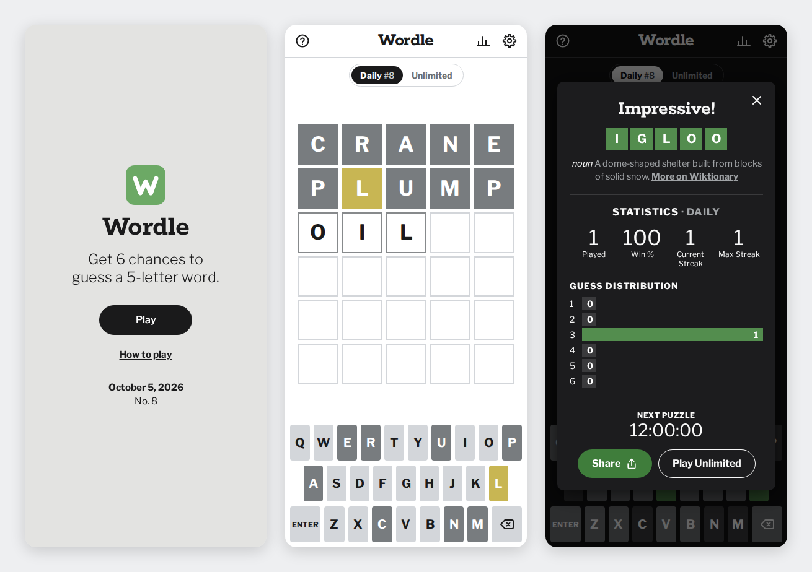

# Voila

Find the hidden five-letter word in six guesses. A fast, accessible word game
that runs in any modern browser, installs like an app, and works offline.

**Play it at [saiprasaad.github.io/voila](https://saiprasaad.github.io/voila/)**



## Features

- **Daily puzzle.** Everyone gets the same word each day, and a new one arrives at local midnight.
  A welcome screen shows the date and puzzle number, and offers to continue a game in progress or
  see today's result.
- **Unlimited mode.** Play as many random words as you like. It never repeats recent words or
  spoils today's daily word, and you can give up on a tough one.
- **Faithful rules.** Duplicate letters are scored the way the original game scores them, and
  guesses are checked against a dictionary of about 8,900 words.
- **Hard mode.** Any revealed hints must be used in later guesses.
- **Statistics.** Games played, win rate, current and best streaks, and a guess distribution,
  kept separately for each mode.
- **Share.** Posts a spoiler-free emoji grid through the share sheet on phones, or copies it to
  the clipboard on desktops.
- **Learn the word.** After each game, a short definition with a link to Wiktionary.
- **Dark theme and high contrast colors.** The theme follows your device until you choose one.
- **Plays anywhere.** Physical or on-screen keyboard, phones in portrait or landscape, tablets
  and desktops.
- **Accessible.** Screen reader announcements for every guess, labelled tiles and keys, full
  keyboard support, reduced motion support, and no axe-core violations.
- **Remembers everything.** Progress, stats and settings survive reloads and stay in sync across
  open tabs.
- **Optional sign-in with Google.** Keep your stats, streaks, settings and games in progress on
  every device. Stats from different devices add up without counting any game twice. Signing in
  is never required, and the game keeps working offline either way.
- **Installable and offline.** A service worker caches the game so it works without a network.

It has no build step and nothing to install at runtime: plain HTML, CSS and JavaScript modules,
about 32 KB gzipped, plus 25 KB for the word list and 58 KB of fonts (the previous Flutter build
downloaded several megabytes). The Firebase code behind sign-in comes from Google's CDN, and only
once a player signs in, opens Settings or reaches for a sign-in button.

## Play locally

Any static file server works. The repository includes a tiny one:

```sh
npm start            # serves http://localhost:8080/
```

ES modules and the service worker need `http://`, so opening `index.html` straight from disk won't
work.

## Tests

```sh
npm install                          # installs Playwright for the browser tests
npm test                             # unit tests for the rules, stats, sync merging and word lists
npx playwright install chromium      # first run only
npm run test:e2e                     # plays the game in desktop and mobile Chromium
npm run test:e2e:ci                  # the same, plus sign-in and sync against the Firebase emulators
```

The sign-in tests run against the [Firebase emulators](#try-sign-in-locally), which need Java 21 or
later. `npm run test:e2e:ci` starts them for the run; `npm run test:e2e` uses them if they're
already running and skips those tests if not. GitHub Actions runs everything on every push and
pull request.

## Deploy

The site is static and every path is relative, so any static host works, from a domain root or a
subfolder. Every merge to `main` goes live automatically on:

- **GitHub Pages**, at [saiprasaad.github.io/voila](https://saiprasaad.github.io/voila/).
  It is served from the root of `main` (**Settings → Pages → Deploy from a branch**).
- **Netlify**, configured by [`netlify.toml`](netlify.toml): no build step, and security headers
  that GitHub Pages can't set. To connect it, choose **Add new site → Import an existing project**
  in Netlify and pick this repository. The settings are read from the file.

## Accounts and sync

Signing in is optional. Accounts use the Firebase project whose settings are in
`js/cloud/config.js`; setting it to `null` turns accounts off. Everything here fits in Firebase's
free Spark plan, with no billing account.

The game always saves to the browser first. While a player is signed in, it merges that copy with
their record in Cloud Firestore (`players/{uid}`) in the background, so it never waits on the
network. Daily results are stored per puzzle and unlimited games are counted per device, so
merging two devices never counts a game twice. [`firestore.rules`](firestore.rules) lets each
player read and write only their own record.

### Set up Firebase

1. In the [Firebase console](https://console.firebase.google.com/), create a project. Google
   Analytics isn't needed. New projects start on the free Spark plan, so leave the plan as is.
2. Under **Project settings → Your apps**, add a web app and copy its `firebaseConfig` values into
   `js/cloud/config.js`. These values are public by design; the security rules protect the data.
   If the project's auth domain changes, update `frame-src` in the page's Content Security Policy
   in `index.html` to match.
3. Under **Authentication → Sign-in method**, enable **Google**.
4. Under **Authentication → Settings → Authorized domains**, add each domain the game is served
   from, such as `saiprasaad.github.io` and the Netlify domain. `localhost` is there already.
5. Under **Firestore Database**, create a database in production mode. Then paste
   [`firestore.rules`](firestore.rules) into its **Rules** tab and publish.

### Try sign-in locally

The [Firebase emulators](https://firebase.google.com/docs/emulator-suite) run sign-in and the
database on your computer, so no Firebase project is needed. They need Java 21 or later.

```sh
npm run emulators    # starts the Auth and Firestore emulators
npm start            # then open http://localhost:8080/?emulators
```

With `?emulators`, **Sign in with Google** signs in a test player instead of opening Google's
sign-in window. Local copies never use the real Firebase project: without `?emulators`, accounts
stay off on `localhost`.

## Project layout

```
index.html              page structure and dialogs
styles.css              layout, themes and animations
sw.js                   offline support (network first, cache fallback)
js/
  main.js               entry point
  app.js                game flow, modes, persistence, dialogs, settings and welcome screen
  game.js               rules: scoring, validation and hard mode (no DOM)
  puzzle.js             daily puzzle numbers and answer selection (no DOM)
  stats.js              statistics and streaks, mergeable across devices (no DOM)
  profile.js            merges a player's progress from two devices (no DOM)
  share.js              emoji results grid (no DOM)
  words.js              answer and guess lists
  definition.js         dictionary lookup after a game
  storage.js            localStorage helpers
  theme.js              applies the theme before first paint
  ui/                   board, keyboard, dialogs, toasts and accessibility helpers
  cloud/                optional sign-in and sync with Firebase
fonts/                  Libre Franklin and Rokkitt
firestore.rules         who may read and write cloud records
firebase.json           emulator settings for local development and tests
tests/unit/             Node test runner specs
tests/e2e/              Playwright specs
scripts/                local server and icon renderer
```

## Word lists

`js/words.js` has two alphabetical, space-separated lists that are easy to edit by hand:

- `ANSWERS`: 1,933 common words that can be solutions. Plurals, simple past tenses, slang
  contractions, proper nouns and offensive words are left out.
- `ALLOWED`: every other word accepted as a guess.

They come from [SCOWL](http://wordlist.aspell.net/) and the public domain ENABLE list. Answers
were chosen by word frequency using [wordfreq](https://github.com/rspeer/wordfreq), then reviewed
by hand. The daily order is a fixed shuffle of `ANSWERS`, so adding or removing a word changes
future puzzles. `npm test` checks the lists' format. See [NOTICE.md](NOTICE.md) for licenses.

## Privacy

There is no tracking and there are no ads. Unless you sign in, everything stays in your browser's
`localStorage`, and the only request to another site is the definition lookup at the end of a
game, which sends the answer word to [dictionaryapi.dev](https://dictionaryapi.dev/).

If you sign in with Google, your stats, settings and games in progress are stored in Firebase
(Google Cloud), linked to your account, and Firebase Authentication keeps the name, email address
and profile photo that Google shares at sign-in. **Settings → Delete account** erases both.

## Credits

Voila is an independent game. Its rules are inspired by
[Wordle](https://www.nytimes.com/games/wordle/), created by Josh Wardle and now owned by The New
York Times, but Voila is not affiliated with or endorsed by either. Wordle is a trademark of The
New York Times Company.

The fonts are Libre Franklin and Rokkitt, under the SIL Open Font License. The original Flutter
version of this game lives in [saiprasaad/Wordle-Clone](https://github.com/saiprasaad/Wordle-Clone).
